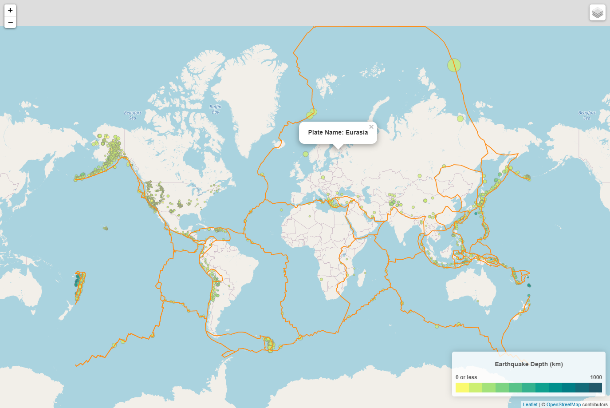
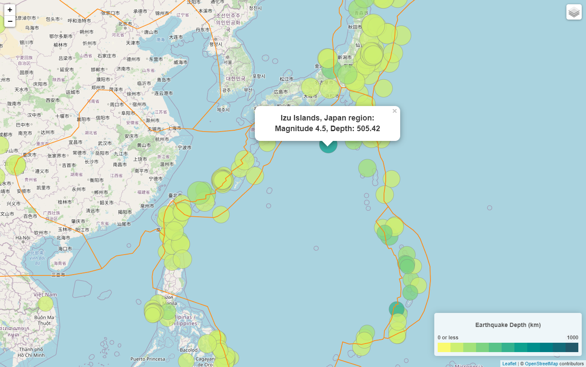

# leaflet-challenge
This assignment consisted of using JavaScript, html, and Leaflet to visualize data.

# What the code does (in general terms)
The code uses GeoJSON information on earthquakes from the [United States Geological Survey](https://earthquake.usgs.gov/earthquakes/feed/v1.0/geojson.php) and tectonic plates from [GitHub](https://github.com/fraxen/tectonicplates) to create an interactive map.

# What the code displays

The **logic.js** code uses leaflet and **chroma.js** , to create a map with the following:
    
    1. Five (5) base maps from https://www.openstreetmap.org and google.

    2. An overlay layer that maps earthquakes from the past 30 days. The size of each marker is dependent on the magnitude of the earthquake, and the color of each marker is dependent on its depth.  Popups provide information on the earthquake when clicked.

    3. An overlay layer the shows earth's tectonic plates. When clicked, a popup gives the name of the plate.

    4. A legend.

**index.html** and **and style.css** create and format the webpage that displays the map.

Screenshots of the map can be seen below:

